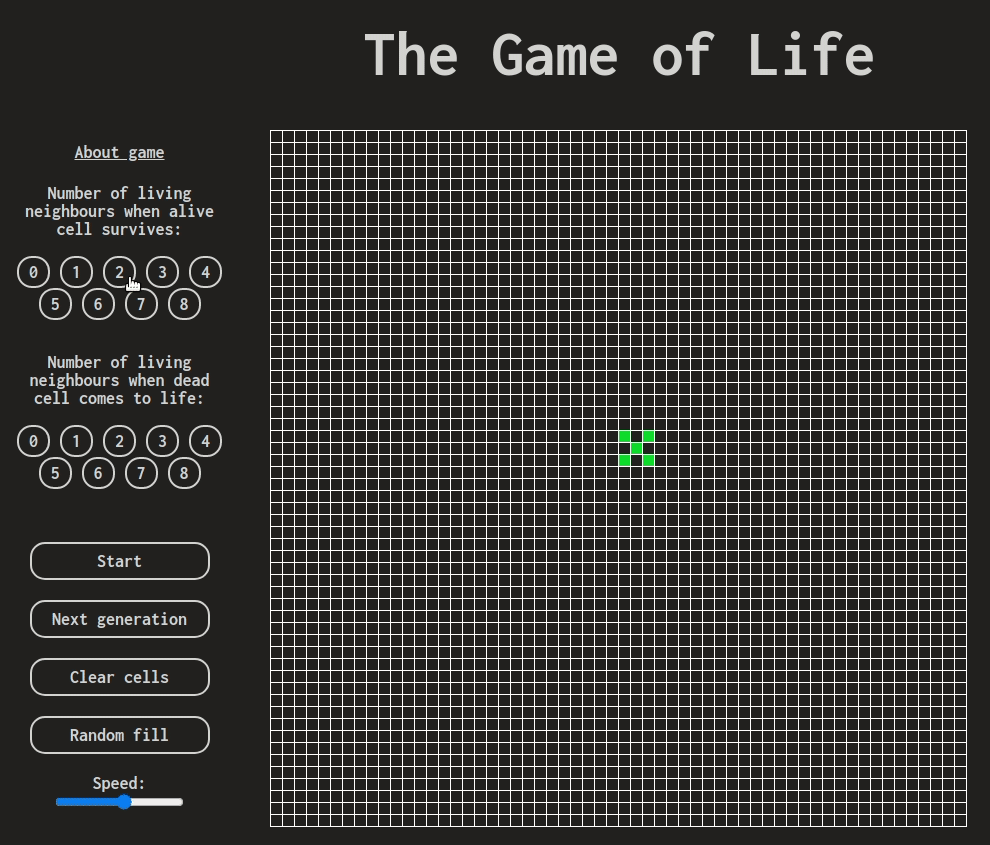
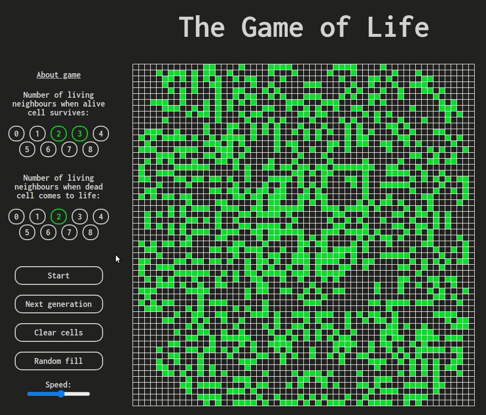
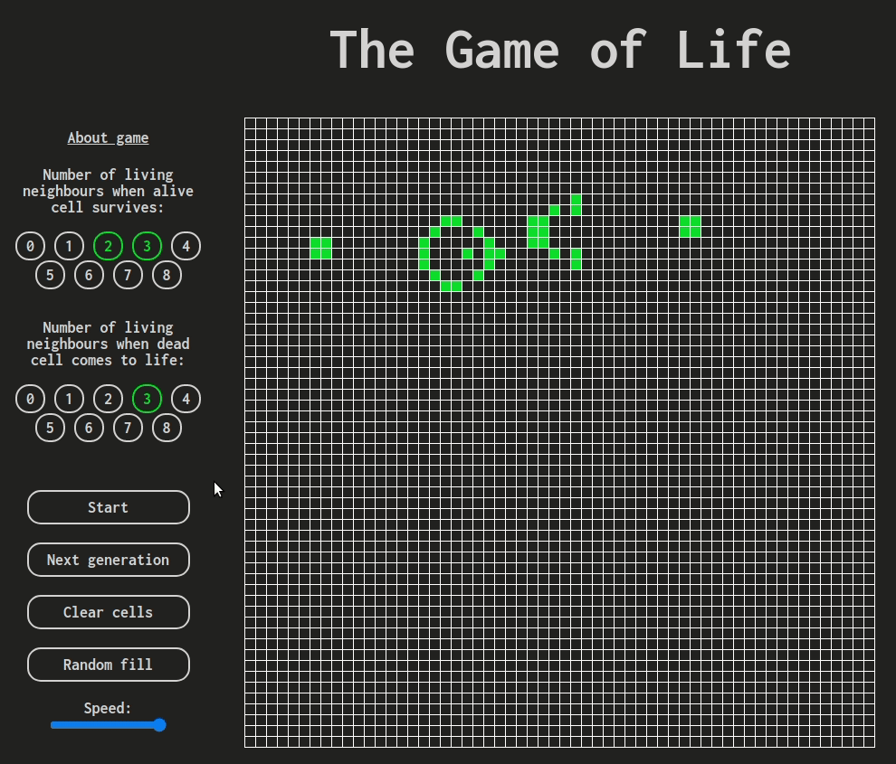
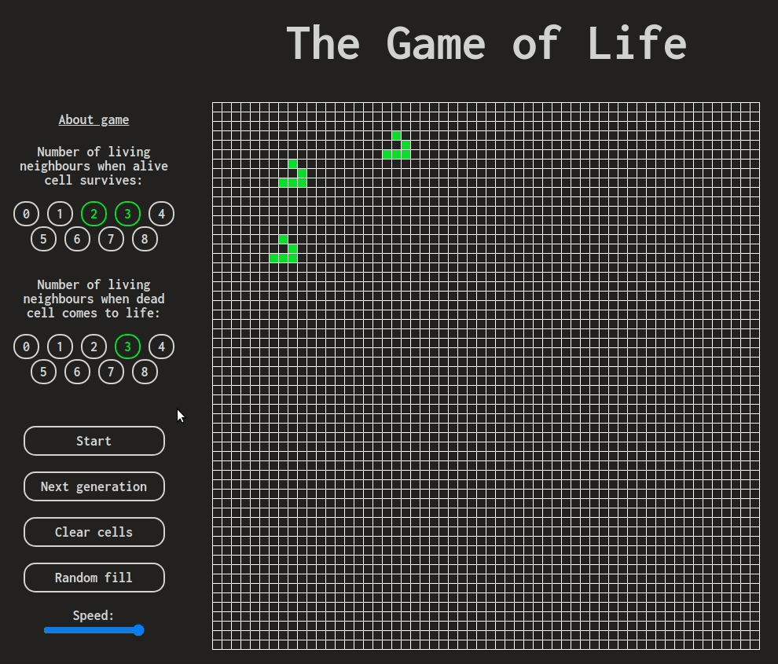

# Game-of-Life

The most popular cellular automaton devised by the British mathematician John Conway in 1970. This is the simple simulator created with JavaScript. If you want to know more about game and rules please visit <a href="https://en.wikipedia.org/wiki/Conway%27s_Game_of_Life">**wiki**</a>. Do you want to try? <a href="https://mateuszsedzimierz.github.io/game-of-life/">**Let's play!**</a>

***
## Some gifs from the game:

---

---

---

